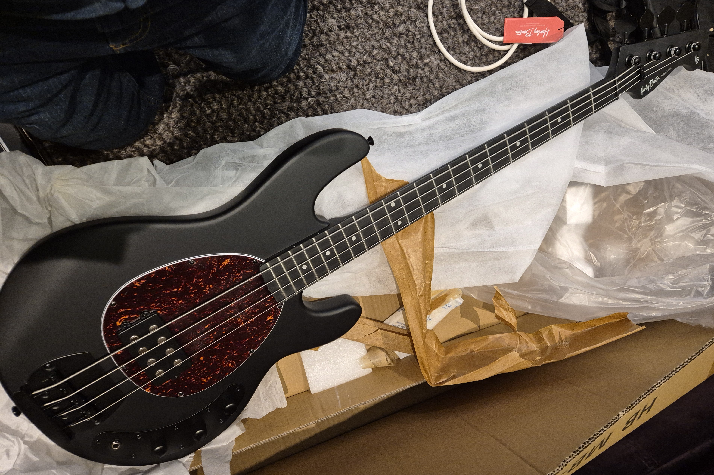
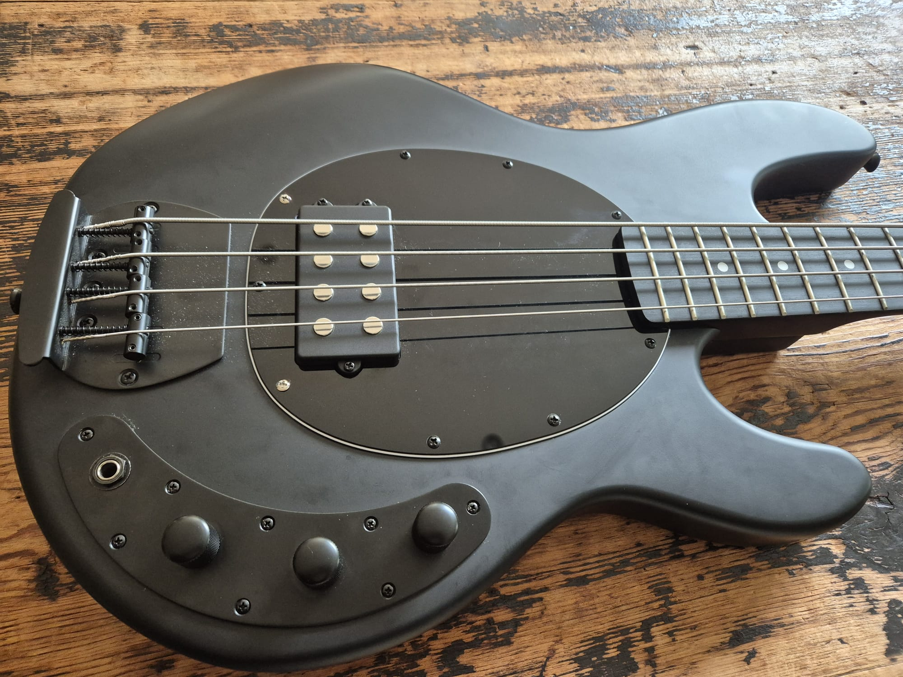

**Why I Bought the Harley Benton MB-4 SBK—and Why I’m Keeping It**

After sending back a [Sterling by Music Man Stingray Ray S.U.B 4](/blog/sterling-by-music-man-sub-sting-ray-4/), I found myself on the hunt for a bass that wouldn’t break the bank but still delivered in all the ways that matter: sound, build, feel, and style. Enter the **Harley Benton MB-4 SBK**—a budget-friendly beast that surprised me in all the best ways.

### First Impressions

Out of the box, the MB-4 SBK oozes attitude. Its **matte black finish**, black hardware, and matching headstock give it a stealthy, modern look. It feels solid, tipping the scales at around **4 kg**, with a full **34-inch scale** and a **bolt-on maple neck** topped with a **roseacer fretboard**. The neck has a comfy D-profile and a nice low action, making it easy to zip around the **21 frets**.

### The Sound

Let’s cut to the chase: **it sounds fantastic**—especially for the price. The **Humbucker pickup** with passive electronics delivers that scooped sound you would expect from a Stingray-style bass. It does have versatility with the tone control you can get some mellow sounds, but it really shines when you crank the treble.

But be warned—the output is **hot**. Like, really hot. So hot, in fact, that it overloads my Digitech Drop pedal. If you’re running into pedals or an interface, you might want to check your gain staging.

### Playability & Build

This thing plays beautifully. The **fretwork is clean**, the **finish is flawless**, and the **build quality feels far above what you'd expect at this price**. The body is made from poplar, which is lightweight but still gives a nice, balanced tone. The **die-cast bridge** is solid and keeps things nicely anchored.

### The Downsides

It’s not perfect, of course. A few small issues stood out:

* The **volume knobs rubbed against the control plate** slightly and needed to be lifted a bit to stop catching.
* The **tuners feel cheap**, and there’s a little play when you turn them—but they **do hold tuning well**, so it’s more of a feel thing than a functional problem.
* I’m not in love with the **two volume knob setup**. I’d personally prefer a single volume control and a standard tone knob, rather than juggling two knobs to blend the coils.
* The matte finish will show fingerprints and smudges, and over time will lose its sheen.

### Final Thoughts

All things considered, the Harley Benton MB-4 SBK punches way above its weight. For the price, you're getting:

✅ Excellent **sound**
✅ Impressive **build quality**
✅ Stealth **aesthetics**
✅ Comfortable **playability**
✅ Remarkable **value for money**
✅ **Passive** electronics (no batteries needed!)

If you’re okay with a couple of minor quirks—and maybe swapping out the tuners down the line—you’ll find a lot to love here. Whether you're just starting out or need a solid backup bass, the MB-4 SBK is a serious contender.

**Would I buy it again? Absolutely.**

[Harley Benton MB-4 SBK product page](https://harleybenton.com/product/mb-4-sbk/)

### Back to Black

One thing that bothered me was the tort pickguard. It just didn’t match the sleek black aesthetic of the rest of the instrument. 

The [Musically pickguard](https://amzn.eu/d/clZIQRN) on Amazon fitted with a small amount of trimming at the neck pocket, and it's 9 holes didn't quite line up with the original 7, but it works well enough.

BTW - You can see the fingerprints and dust that the matte finish picks up :¬)