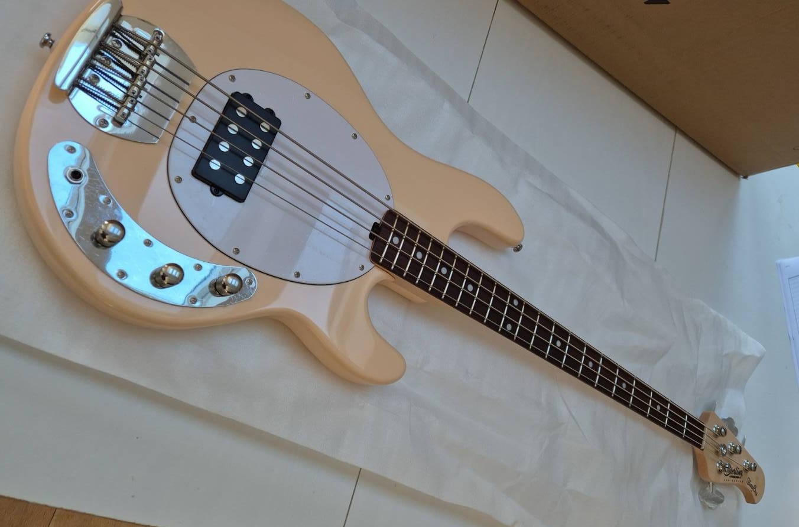

**Sterling by Music Man S.U.B. Ray4 Review – The Budget Stingray That Missed the Mark**

Let’s get one thing out of the way: I’ve **always wanted a Stingray**. That big, bold Music Man tone, the iconic look, and that unmistakable 3+1 headstock have been calling my name for years. So when I spotted the **Sterling by Music Man S.U.B. Ray4**, I figured this might finally scratch the itch—without emptying the wallet.

**S.U.B.**, in case you didn’t know, stands for **"Sports Utility Bass"**—and this Indonesian-made model is the most affordable entry into the Stingray world. It’s got the vibe, the looks (mostly), and the layout. But unfortunately, it didn’t quite deliver in the ways that matter most.

---

### First Impressions

Out of the box, the **Vintage Cream finish** was… not quite what I expected. Online it looked classy and understated, but in person it leaned a bit more **pink**—kind of a **"skin tone"** shade that didn’t feel as bold or confident as I hoped. That’s purely subjective, of course, but it did leave me a little underwhelmed at first glance.

That said, it still has the **classic Stingray shape**, the **3+1 headstock**, and a nice slim **38mm nut width** that makes it comfortable in the hand.

---

### Build & Hardware

Now, this is where things started to wobble—literally. While tuning up for the first time, **two of the tuners slipped** as I tightened them. That’s not something you want to experience on a brand-new bass, no matter the price.

The body is made of **basswood**, paired with a **maple neck** and a **jatoba fretboard**. It's a familiar recipe for budget instruments, and overall the construction is okay. Nothing alarming—aside from the tuners—but nothing exceptional either.

---

### Tone & Electronics

The S.U.B. Ray4 comes equipped with a single **H-1 ceramic humbucker** and **active 2-band EQ**. On paper, that should give you plenty of tonal flexibility and the aggressive Stingray bite we all know and love.

In practice? It just felt a little **flat**. The tone lacked **dynamics**, and even with some EQ tweaking, I couldn’t quite dial in the kind of presence I was after. The **active electronics** gave it volume and brightness, but not much character. It felt like the essence of the Stingray was only half there—like a photocopy of a painting.

---

### Verdict: Good, But Not Great

Look, this isn't a *bad* bass. It’s a **decent entry point** if you want to get close to the Stingray aesthetic and layout without the cost. But for me, it didn’t quite deliver where it mattered. Between the underwhelming tone, the slightly off colour, and the tuner issues, I just couldn’t justify keeping it.

Especially when you consider that my **[Harley Benton MB-4 SBK](/blog/harley-benton-mb-4-sbk/)**, which costs **about a third of the price**, feels about the same level of build quality and sounds better to my ears.

---

### The Bottom Line

✅ **Pros**:

* Classic Stingray shape and layout
* Comfortable neck with a slim nut width
* Active EQ offers tonal options
* That 3+1 headstock still looks cool

❌ **Cons**:

* Flat, uninspiring tone
* Colour looked different in person
* Tuner reliability was questionable
* Doesn’t feel like good value compared to [other options](/blog/harley-benton-mb-4-sbk/)

If you’re desperate for a Stingray and you're on a tight budget, the S.U.B. Ray4 might scratch the itch—just don’t expect fireworks. Personally, I think there are better-value alternatives out there.

**Final verdict? Close, but no cigar.**
