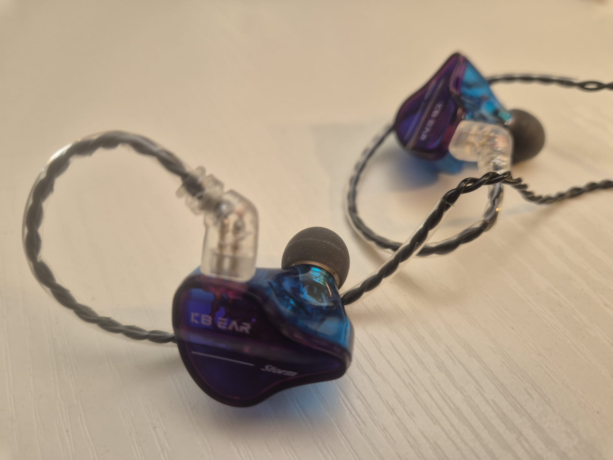

### Overview

The **KBEAR Storm** is a budget-priced single dynamic driver (1DD) in-ear monitor (IEM) from Yinyoo, designed with the aim of bringing high-fidelity sound to musicians, performers, and everyday listeners. At just **£17.99**, it promises impressive specs for the price — including a detachable silver-plated cable, a 10mm magnetic driver, and multiple eartip options.

We were intrigued. Unfortunately, when it comes to bass — the one thing that really matters for this site — the KBEAR Storm fails hard.

---

### Pros

* **Good Build Quality**: The plastic housings feel well-made and solid, especially at this price point.
* **Comfortable Fit**: Lightweight and ergonomically shaped; they stay put during long sessions without fatigue.
* **Attractive Design**: Available in several colours with a sleek, modern look.
* **Decent Accessories**: Comes with multiple eartips (6 pairs in 3 sizes), which helps with fit and isolation.
* **Quiet Cable**: The over-ear cable doesn't transmit rubbing noise, and it's removable, allowing for upgrades.

---

### Cons

* **Lack of Bass Response**: The biggest issue. The low end is **practically absent**, and even EQ boosting doesn't help much.
* **Tinny Sound**: Without low-end support, the overall sound signature leans heavily toward thin and brittle.

---

### The Bass Test

As a **bass-centric review site**, we're always evaluating IEMs by how well they handle low frequencies — both for **listening** and **monitoring live bass**. The KBEAR Storm, despite manufacturer claims of "powerful and affecting bass," simply does **not deliver**.

No matter the source — phone, DAC/amp, or EQ tweaks — the low end remained thin and lifeless. Boosting 60–100 Hz did very little. Even 500 Hz boosts to recover warmth didn't add punch. For bass players or fans of bass-heavy music, this makes the KBEAR Storm **unusable**.

---

### Verdict

If you're on a **tight budget**, mainly listening to podcasts, or using a Samsung phone with Dolby Atmos and you **don't care about bass**, the KBEAR Storm might be a comfortable and affordable entry-level IEM.

But if you're a **bass player**, a **music producer**, or just a **fan of heavy low-end**, **these are not for you**.

---

### Final Rating

🎧 **Comfort & Fit**: ★★★★☆

🎨 **Build & Aesthetics**: ★★★★☆

💰 **Value for Money**: ★★★☆☆

🎵 **Sound (General)**: ★★☆☆☆

🎸 **Bass Performance**: ☆☆☆☆☆ *(unusable for bass monitoring)*

