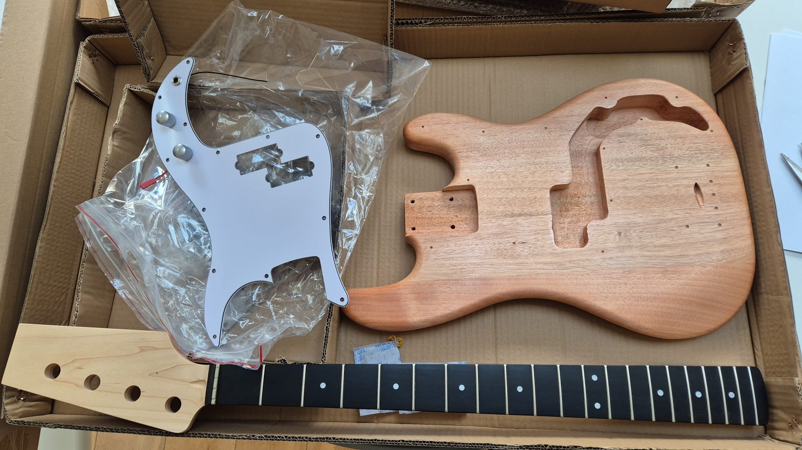

### Summary

If you’ve ever wanted to build your own bass guitar without breaking the bank, the Harley Benton Bass Guitar Kit P-Style is a fantastic place to start. For just £85, you get everything you need: a maple neck, Rengas body (already primed!), amaranth fretboard, all the hardware, electronics, and even strings. It’s light, comfy, and—best of all—fun to put together. The kit is super approachable, even for beginners, but if you want a flawless painted finish, you’ll need a bit of patience (and maybe some practice). The stock tuners and pickup are basic, but that’s part of the fun: you can upgrade as you go. If you’d rather skip the DIY adventure, Harley Benton’s factory-finished P-Style basses are only a little more expensive.

---

### Building Experience

* **Everything in the box**: You get a bolt-on maple neck with a double-action truss rod, amaranth fretboard, pre-wired P-style split-coil pickup, volume and tone pots, and all the chrome hardware.
* **No soldering stress**: The electronics are pre-wired, so you don’t need to touch a soldering iron.
* **A little care goes a long way**: Take your time with sanding, lining things up, and fitting the parts. It’s straightforward, but a careful approach pays off.
* **Shaping the headstock** and picking your own finish is fun. Many folks say it’s “very easy to build” and “enjoyable”—and you don’t need to be a pro to get a playable result.

---

### Cost and Value

* **Super affordable**: At £85, this kit is cheaper than most entry-level basses you’ll find in stores.
* **You get what you pay for**: The basics are all here, but some parts (like tuners, strings, and the pickup) are ripe for upgrading if you want to take things further.

---

### Finish and Painting

* **Ready for paint**: The body and neck come primed with pore filler, so you can get straight to painting.
* **Wood grain character**: The Rengas wood grain still peeks through, even after painting. Some people love the look, others might want a smoother finish.
* **Patience is key**: Spray painting takes a gentle touch—sand up to P320 grit, use thin coats, and don’t rush. Runs and rough spots are easy to get if you hurry.
* **Other options**: If spray cans aren’t your thing, you could try staining, using a lacquer gun, or even asking a pro to finish it for you.

---

### Hardware Quality

* **Basic but functional**: The included die-cast tuners work, but they can slip under tension. One of mine even had to go back. If tuning stability bugs you, swapping in locking tuners is a great first mod.
* **Chunky bridge**: The bridge is solid and does the job. Not the first thing I’d upgrade.
* **Bridge mounting caution**: The pre-drilled bridge screw holes on my kit weren’t perfectly lined up, so I had to tweak things a bit to get the bridge sitting right. Double-check before you screw it down!
* **Classic pickup**: The split-coil P-Style pickup gives you that familiar Precision bass sound, but it’s a bit on the thin side. Upgrading to a beefier or active pickup is a popular move.
* **Pickguard mounting caution**: Watch out when screwing in the pickguard—one of my screws broke through where the control cavity was routed, chipping the body. The wood here is fragile, so don’t overtighten, and consider reinforcing the holes with a dab of wood glue or a toothpick.

---

### Playability and Feel

* **Nice and light**: The finished bass weighs about 3.5 kg, so it’s easy on your shoulder for long jams.
* **Comfortable neck**: The Canadian maple neck (42 mm nut) and amaranth fretboard feel just like a classic P-bass. Frets are generally good, but a little fret dressing might help.
* **String swap recommended**: The stock strings (.045–.105) are nothing special—putting on a fresh set makes a big difference in tone and tuning.

---

### Customization and Options

* **Make it yours**: The headstock is a blank canvas, and you can upgrade electronics, pickguards, and hardware whenever you like. It’s a project that can keep evolving.
* **Learn as you go**: Building and tweaking the kit is a great way to pick up skills in woodworking, finishing, setup, and electronics—perfect for any bassist who likes to tinker.

---

### Conclusion

If you’re looking for a fun, budget-friendly way to build your own bass, the Harley Benton Bass Guitar Kit P-Style is hard to beat. It’s light, playable, and gives you plenty of room to experiment and upgrade. If you want a perfect finish and pro-level hardware right out of the box, the factory-finished version might be a better fit—but for hands-on types, this kit is a real treat.
